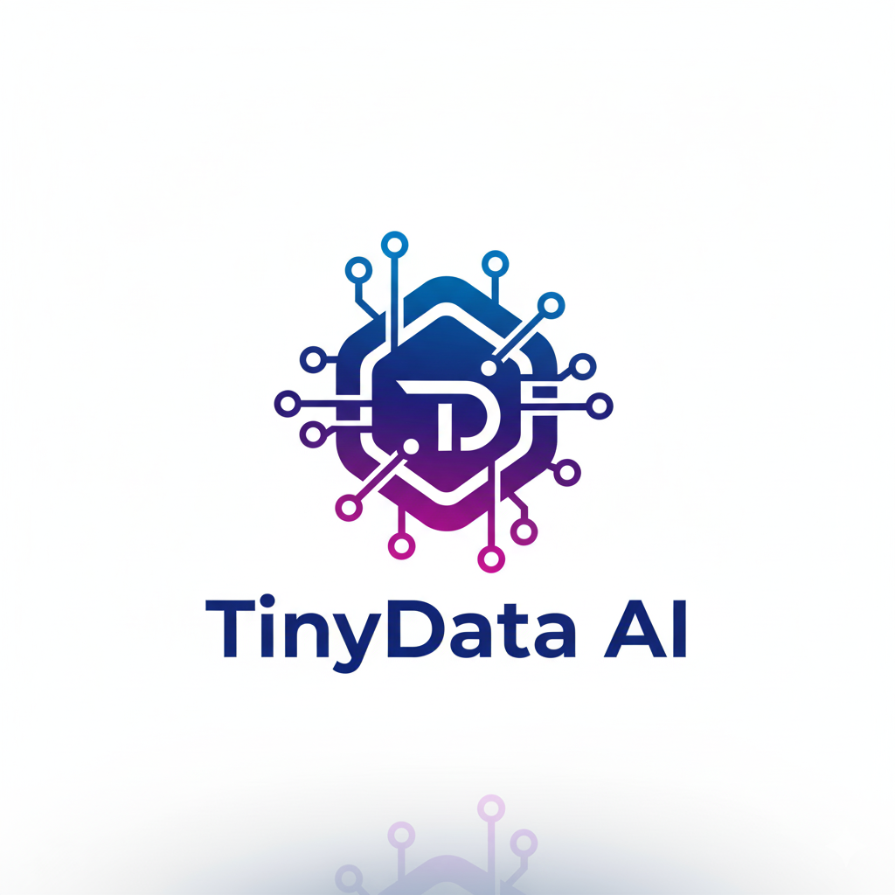

  

<h1 align="center">
  👋 Welcome to TinyData AI
</h1>

  <strong><a href="https://github.com/TinyDataML">TinyData-ML, where data is valued.</a></strong>

  Welcome to <strong>TinyData AI</strong>! We are a team of AI researchers and engineers with our roots at <strong>Peking University</strong>. 
    
  Our mission is to bridge the gap between cutting-edge academic research and real-world industry applications through the <strong>Data-Centric AI</strong> paradigm.

---

## 🚀 Our Philosophy: Data-Centric AI

We firmly believe that high-quality, high-signal data is the cornerstone of any great AI system. While traditional Model-Centric AI development focuses on iterating on code and algorithms, we champion a shift in focus.

In complex, real-world applications, systematically improving the data often yields more significant and reliable performance gains. All our tools are built around this core principle, designed to help developers efficiently understand, clean, augment, and manage their data to unlock the full potential of AI.

---

## 🛠️ Our Core Projects

We are building a suite of tools, prefixed with "Tiny", to create data-driven productivity systems for various AI domains.

| Project         | Description                                                               | Status                |
| :-------------- | :------------------------------------------------------------------------ | :-------------------- |
| ⭐️ **[Tiny3D](https://github.com/TinyDataML/Tiny3D)** | The first Data-Centric AI production system for 3D applications.          | 🚀 Active Development |
| **[Tiny2D](https://github.com/TinyDataML/Tiny2D)** | A next-generation AI production system for 2D vision.                     | 🌱 Early Stage        |
| **[TinyLabeling](https://github.com/TinyDataML/TinyLabeling)** | A deep learning tool for automated data annotation.                       | 🌱 Early Stage        |
| `TinyMedical`   | A next-generation production system for Medical AI. *(See Collaborations)* | 🔒 Private             |

---

## 🤝 Collaborations

Our academic roots drive our passion for collaboration. We partner with leading institutions to bridge the gap between AI research and real-world impact. Our key collaborations include:

* **Peking University Third Hospital**: We are partnering to develop cutting-edge Medical AI solutions with our `TinyMedical` system, aiming to bring data-centric methodologies to critical healthcare challenges.

---

## ✨ Featured Project: Tiny3D

**[Tiny3D](https://github.com/TinyDataML/Tiny3D)** is our flagship project, a comprehensive production system for 3D object detection services.

It is built with four transformative features:

* **Performance Optimization Engine**: A Data-Centric approach to help users easily achieve high-accuracy and high-speed 3D detection services.
* **One-Line Full Pipeline**: Complete the entire workflow—from dataset editing and model training to compression and deployment—with a single line of code.
* **Fine-grained Data Editing**: Supports granular operations on datasets of any size, down to a single data point.
* **User-Friendly Web Interface**: (Planned) A low-code, visual interface to enhance team collaboration and productivity.

👉 **[Learn more about Tiny3D here!](https://github.com/TinyDataML/Tiny3D)**

---

## 💬 Get Involved

We are an open and dynamic community, welcoming developers, researchers, and students interested in Data-Centric AI! You can get involved in many ways:

* **Try our projects**: Take `Tiny3D` for a spin and share your feedback.
* **Submit Issues**: Found a bug or have a feature request? Open an issue in the relevant repository.
* **Contribute Code**: Pull Requests are always welcome, from small bug fixes to new features.
* **Join the Discussion**: Share your ideas with the community on our [Discussions](https://github.com/orgs/TinyData AI/discussions) tab. (*Note: Please enable this feature in your organization's settings.*)

Let's build the next generation of AI development tools together!
